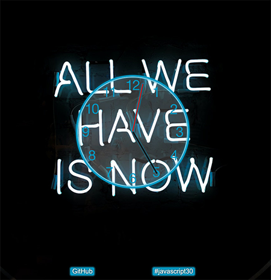

# [Wes Bos' 30 days Vanilla JS challenge](https://javascript30.com/).

## No frameworks, no compilers, no fuss.

### **[Day 02: Clock](https://2y2son4.github.io/clock-day02)**.

#### **CSS**

- transform:
  - rotate()
- transform-origin
- transition-timing-function:
  - cubic-bezier

#### **JS**

- Date()
  - .getSeconds()
  - .getMinutes()
  - .getHours()
- Element.style
- setInterval

